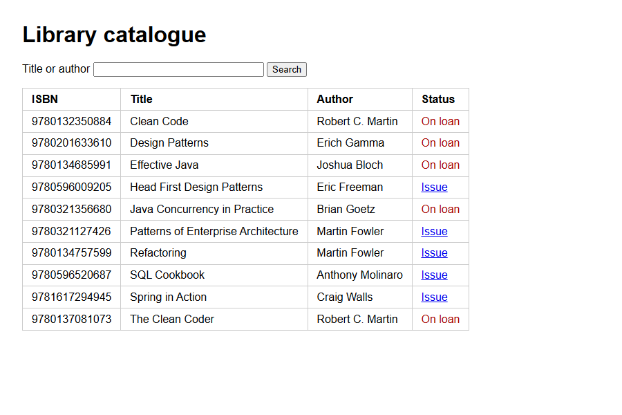
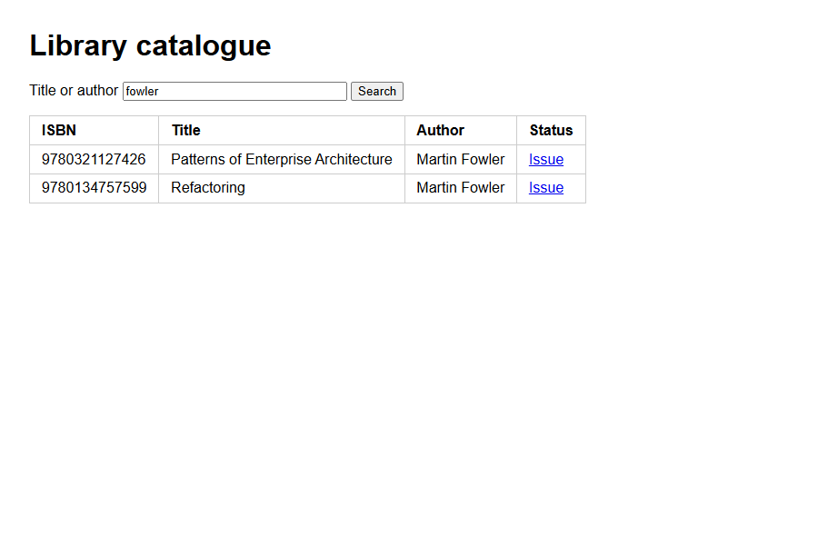
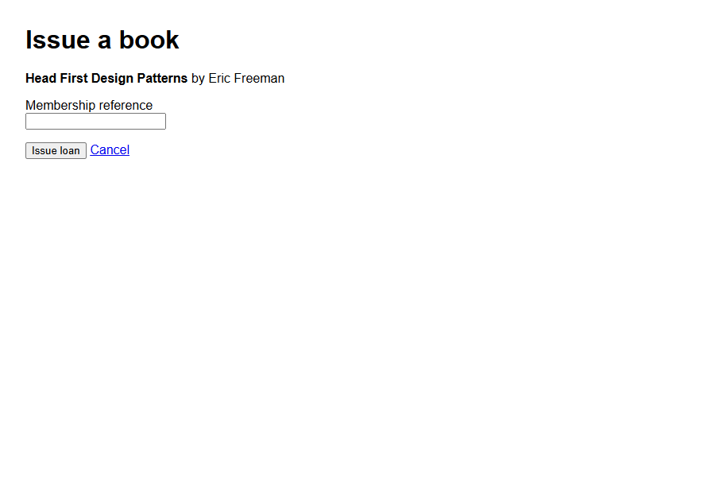
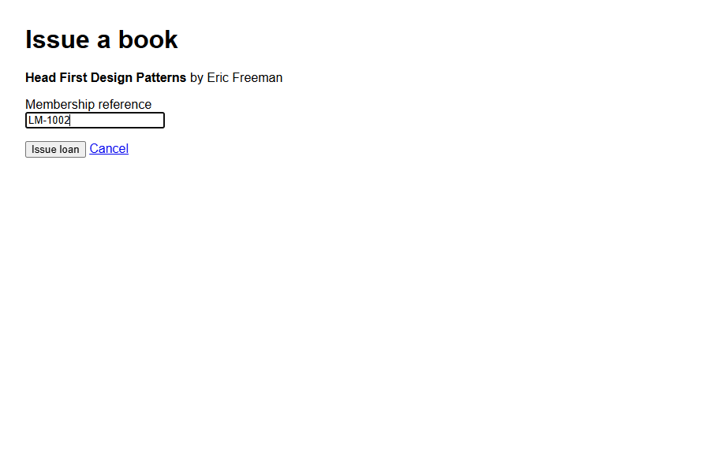
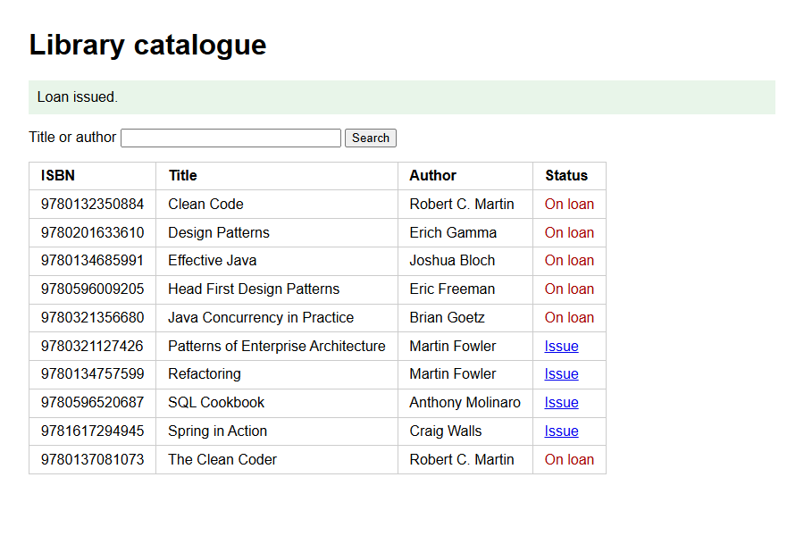
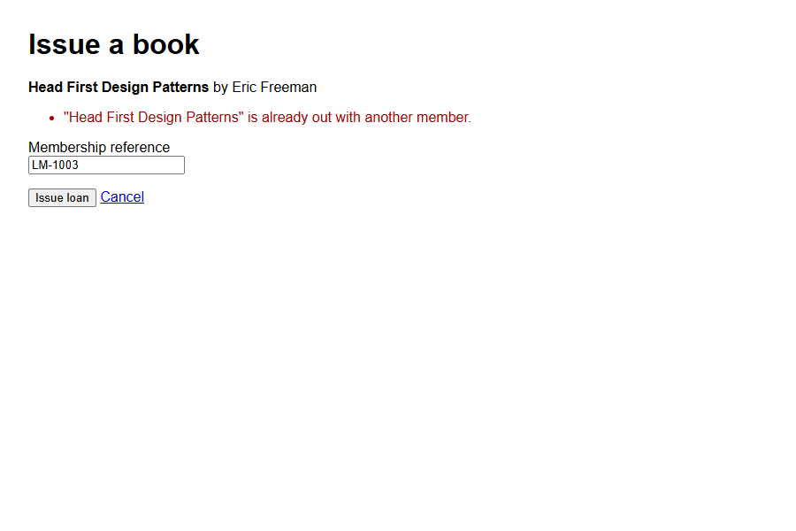
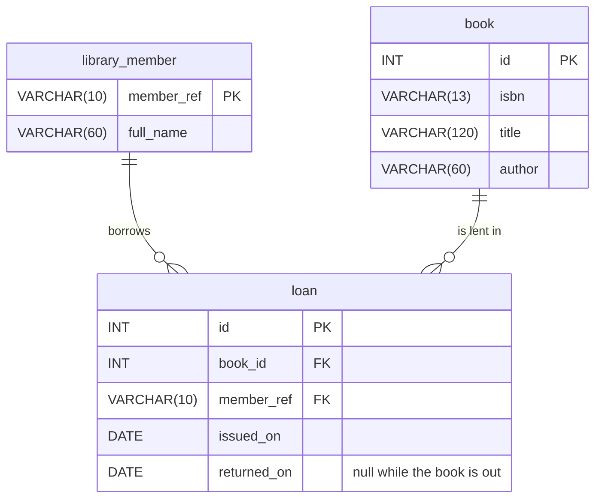

# Library Loans

A small Spring Boot web application for a library. Staff search a catalogue of
books and issue loans to library members.

## The task

Spend ten minutes reading the code, then talk us through it: what the
application does, how a request moves through it, and anything you would
question or change. There is no need to run it.

## Requirements

- The catalogue can be searched by title or author.
- A book that is already on loan cannot be issued again until it is returned.
- A member may hold at most five books at once.
- Loans may only be issued to registered members of the library.

## Screens

The catalogue lists every book and whether it is available:

Searching by title or author narrows the list:

Choosing "Issue" opens a form for the member's reference:

When the loan is issued, the catalogue is shown again with the book on loan:

A loan that breaks a rule is refused, and the form is shown again with the
reason:

## Layout

| File | Purpose |
| --- | --- |
| `LibraryLoansApplication.java` | Starts the application |
| `Book.java` | A book in the catalogue |
| `LibraryDao.java` | Database access, using `JdbcTemplate` |
| `LoanValidator.java` | Checks made before a loan is issued |
| `CatalogueController.java` | `GET /catalogue`: search and list books |
| `IssueLoanController.java` | `GET/POST /issue`: the loan form |
| `WEB-INF/views/*.jsp` | The two pages |
| `schema.sql`, `data.sql` | Tables and sample data |
| `application.properties` | Server, database and view configuration |

## Data model

